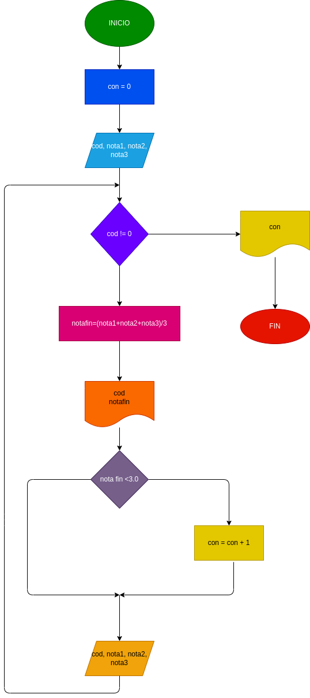

# Ejercicio 1

## Hacer el diagrama de flujo y el programa en python que por cada estudiante lea el codigo y el nombre, y las notas de los tres parciales de una materia, y que calcule e imprima, el codigo, el nombre y la nota final de cada estudiantes. No sabemos cuantos estudiantes son, pero despues de la informacion del ultimo, se introduce cero en el campo correspondiente al codigo, de tal modo que sirva como **Centinela**, para indicar cuando terminan los datos de enbtrada. Tambien se debe informar al final cuantos estudiantes pierden la materia.

 