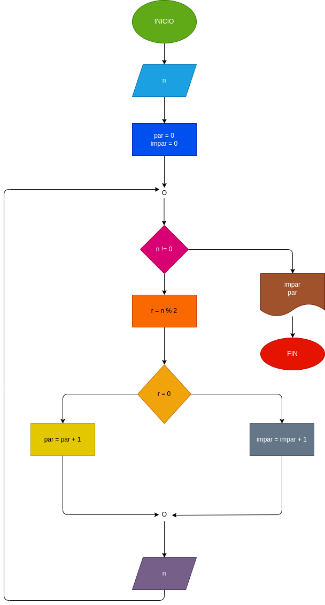

# Ejercicio 2

## Hacer el diagrama de flujo y el programa en python, que lea números enteros y positivos (uno en cada lectura), y que averigüe e imprima cuantos son pares y cuántos son impares. Para terminar utilizaremos centinela, cuando el valor del numero leído sea cero

 